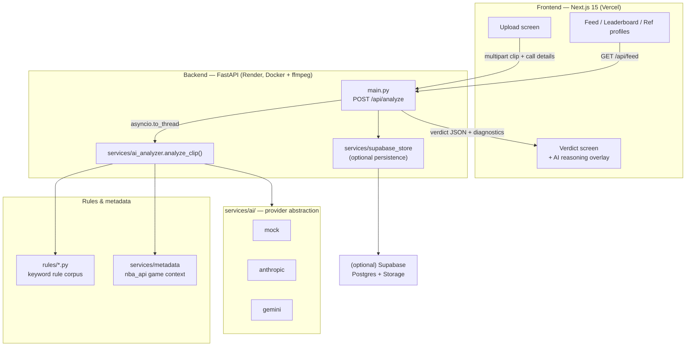
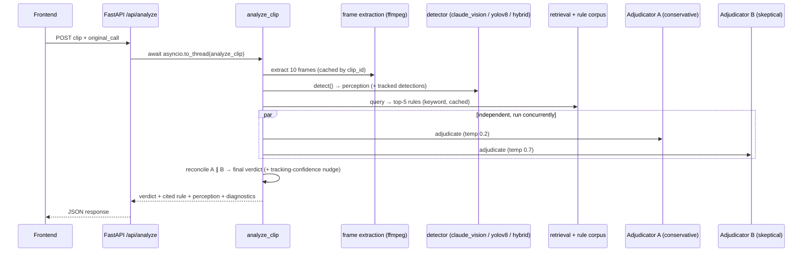

# RefCheck AI — Architecture

RefCheck AI reviews a sports officiating call from a short video clip and returns a
structured verdict (**fair call / bad call / inconclusive**) with confidence, a cited
rule, and the reasoning behind it. The core is a **four-agent AI pipeline** that talks
to any LLM backend (Anthropic, Gemini, or an offline mock) through one interface.

## System overview

## Request → verdict (the four-agent pipeline)

`analyze_clip()` (in `backend/services/ai_analyzer.py`) is a **synchronous**
orchestrator the FastAPI route calls off the event loop via `asyncio.to_thread`. It
talks to LLMs **only** through the provider seam, so the same code runs against
Anthropic, Gemini, or the mock unchanged.

The four agents:

1. **Perception** — describes the frames as structured JSON; issues *no* verdict.
2. **Retrieval** — turns the perception into a precise rulebook query.
3. **Adjudicator A** (conservative, temp 0.2) — gives the original call the benefit of the doubt.
4. **Adjudicator B** (skeptical, temp 0.7) — independently challenges the call.

`_reconcile()` merges A and B: agreement → that verdict with averaged confidence;
disagreement or weak perception → `inconclusive` with damped confidence.

## Key backend modules (`backend/`)

| Path | Responsibility |
|------|----------------|
| `main.py` | FastAPI app: `/api/analyze`, `/api/feed`, media routes, CORS, health/readiness/version/metrics, and the observability middleware (request-id, structured logging, metrics, optional auth + rate limiting). |
| `services/observability/` | Structured JSON logging + in-process Prometheus metrics registry (Sprint 15). |
| `services/security/` | Optional API-key auth + fixed-window rate limiting, both off by default (Sprint 15). |
| `services/health.py` | Liveness + readiness (provider/ffmpeg/upload-dir checks) reporting. |
| `services/ai_analyzer.py` | Pipeline orchestration, reconciliation, diagnostics, caches. |
| `services/ai/` | Provider abstraction (`AIProvider` + `anthropic` / `gemini` / `mock` + factory). |
| `sports/` | **Sport plugins** (`Sport` interface + `SportRegistry` + `basketball/` + `GenericSport` fallback). Owns per-sport prompts, rule boosts, sport-details, tracking, and game context; the pipeline resolves one via `get_sport(sport)` — no `sport == "basketball"` checks. |
| `services/detectors/` | `claude_vision`, `yolov8`, `hybrid` detectors (Claude perception + optional YOLO tracking). |
| `services/extractors/` | Sport-detail + tracked-evidence extraction (basketball vision). |
| `services/metadata/` | NBA game-context enrichment (nba_api; additive, guarded). |
| `services/config.py` | Single source of truth for env-var names and defaults. |
| `services/registry.py` | Generic `Registry[T]` behind providers/detectors/extractors. |
| `rules/*.py` | Static keyword rule corpus (no embeddings/FAISS). |
| `evaluation/` | Offline benchmarking: accuracy/precision/recall/F1, calibration, latency, provider comparison, HTML/MD reports. |
| `scripts/` | `demo_analyze.py` (single clip) and `run_demo_suite.py` (curated 10-scenario suite). |

## Design principles

- **Provider-swappable by env var.** `AI_PROVIDER=mock|anthropic|gemini`; vendor
  plumbing never leaks into the pipeline. Adding a provider = one class + one
  registry line.
- **Sports are plugins.** Each sport implements the `Sport` interface (prompts,
  rule boosts, sport-details, tracking, game context) and registers in the
  `SportRegistry`. The pipeline calls `get_sport(sport)` and never branches on
  `sport == "basketball"`; adding a sport = one plugin + one registry line, with
  zero changes to the pipeline, providers, detectors, or evaluation.
- **Graceful degradation.** Missing key/ffmpeg/ultralytics degrades to the mock
  fallback (surfaced in `diagnostics.fallback_reason`); a YOLO failure in hybrid
  mode keeps Claude's perception instead of failing the analysis.
- **YOLO is supporting evidence only.** Tracked detections ground the adjudicators
  and calibrate confidence but never override the semantic verdict, and never
  change the API contract.
- **Same response shape everywhere.** The response is assembled as plain dicts;
  `frontend/src/lib/types.ts` mirrors it. Additive fields (e.g. `diagnostics`) are
  backward compatible.

See [CLAUDE.md](../CLAUDE.md) for the exhaustive, file-level architecture reference.
